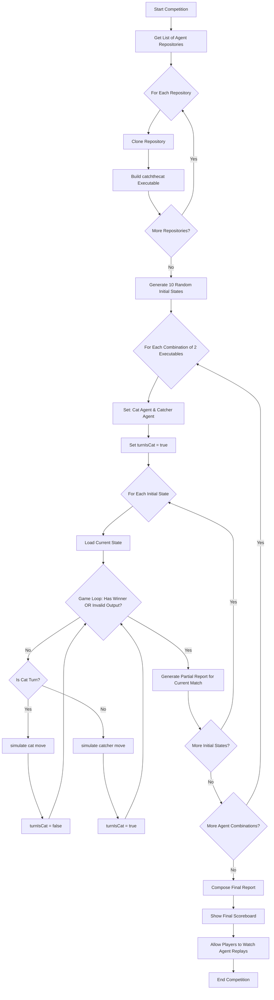

# Catch The Cat AI Competition

This repo contains the code for running the competition of AI agents for the catch the cat game.

## Rules

https://gameguild.gg/p/ai4games/catchthecat

## Steps



## Rules for points

Summary:

There are 2 set of rules for points:

- Number of moves made in onder to win, so you have to make it win with the less moves as possible;
- Time spent processing each move, so your algorithm with the less time as possible;

### Moves Score

- In a square board of size` N*N`, the maximum number of catcher moves is` N*N`.
- If the cat wins:
    - Cat receives `N*N - moves` points.
    - Catcher receives `moves` points.
- If the catcher wins:
    - Catcher receives `N*N - moves` points.
    - Cat receives `moves` points.

The result will be normalized by dividing the result by `N*N`.

### Time Score

- The maximum time limit is `0.1s`;
- If the time limit is reached, the other agent wins;
- Both agents have timers that will deduct it from the `Move Score`;

### Match Score

A match is when two users play against each other in a game.

```
CatScore = CatMoveScore - CatTimeScore * Weight

CatcherScore = CatcherMoveScore - CatcherTimeScore * Weight

UserScoreOnMatch = CatScore + CatcherScore
```

### Competition Score

```
UserScore = {
  cat: 0,
  catcher: 0,
}
Usernames[]; // list of usernames
UserScores = Map<UserName, UserScore>
InitialStates[] = generateRandomInitialStates(10)
for each InitialState in InitialStates:
    for each cat in Users:
        for each catcher in Users:
            if cat == catcher:
                continue
            matchReport = playGame(cat, catcher, InitialState)
            UserScores[cat].cat += matchReport.catScore
            UserScores[catcher].catcher += matchReport.catcherScore
Sort UserScores by the sum of cat and catcher scores
Generate html report
```

## CI/CD and GitHub Pages Deployment

This repository includes a GitHub Actions workflow that automatically builds and deploys the competition reports to GitHub Pages.

### Workflow Features

- **Automatic Deployment**: Triggers on pushes to `main` or `master` branches
- **Daily Scheduling**: Automatically runs daily at 2 AM UTC to generate fresh reports
- **Manual Deployment**: Can be triggered manually via GitHub Actions UI
- **Report Generation**: Runs `npm run report` to generate competition data
- **React App Build**: Builds the React application for web deployment
- **GitHub Pages**: Deploys the built application to GitHub Pages
- **Smart Caching**: Caches npm dependencies and cloned repositories for faster builds

### Setup Instructions

1. **Enable GitHub Pages**: Go to your repository settings → Pages → Source: "GitHub Actions"
2. **Configure Repository**: Ensure the `homepage` field in `package.json` matches your GitHub Pages URL
3. **Push Changes**: The workflow will automatically run on pushes to main/master
4. **View Results**: Access your deployed competition reports at `https://[username].github.io/[repository-name]`

### Workflow File

The workflow is defined in `.github/workflows/deploy.yml` and includes:
- Node.js 18 setup with npm caching
- Smart caching for npm dependencies and cloned repositories
- Daily scheduling (2 AM UTC) for automated report generation
- Dependency installation
- Competition report generation
- React application build
- GitHub Pages deployment with proper permissions

### Caching Strategy

The workflow implements intelligent caching to improve performance:
- **NPM Dependencies**: Cached based on `package-lock.json` hash
- **Repository Cache**: Caches cloned repositories in `./repos` and `./deps` folders
- **Cache Keys**: Uses OS and file hashes for optimal cache invalidation

### Local Development

To run the competition locally:
```bash
npm install
npm run report  # Generate competition data
npm start       # Start development server
```
